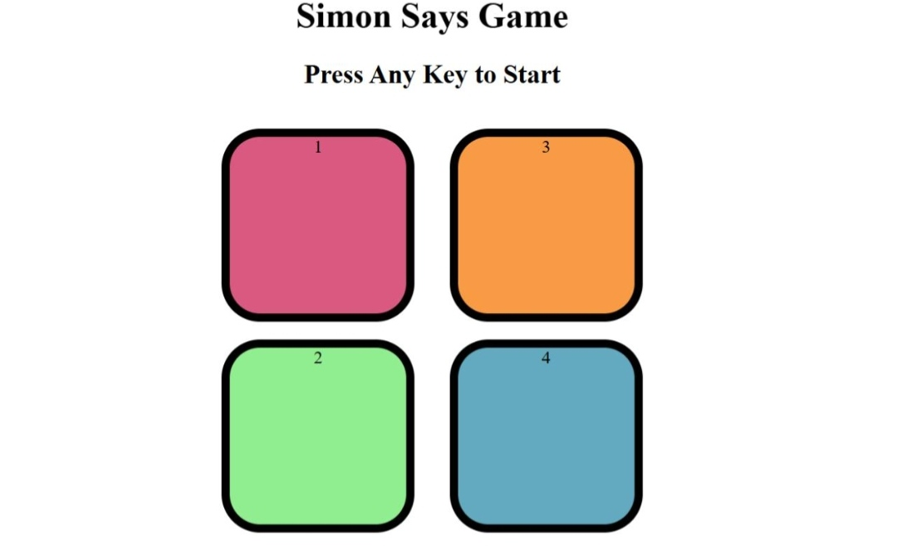

# 🧠 Simon Says Game
A simple memory game built with **HTML, CSS, and JavaScript**.

## 📸 Output

## 🎮 How to Play
Only in Laptop
Press any key to start.  
Watch the sequence and repeat it by clicking the buttons in order.  
If you make a mistake, the game ends and shows your score.

## 🧩 Technologies Used
- HTML
- CSS
- JavaScript (DOM Manipulation)

## 🚀 Live Demo
[Play Now](https://Manasa-L-Hegde.github.io/Simon-Says-Game/)

Testing Pull Shark Badge
Testing feature2
